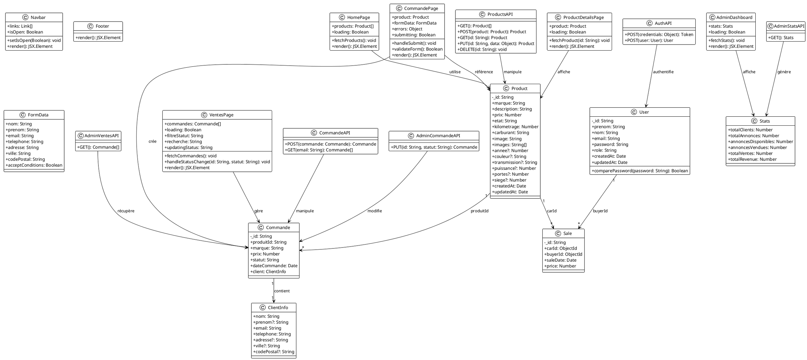
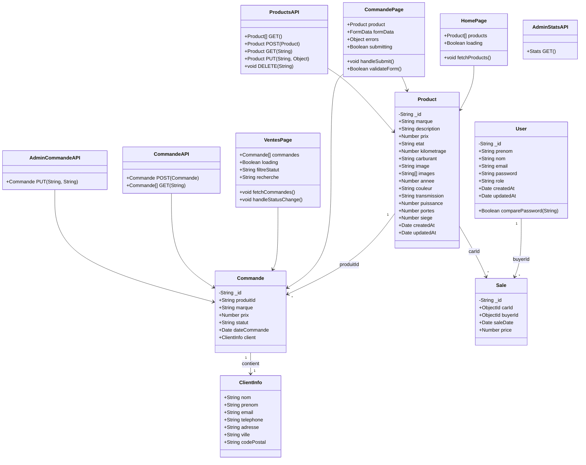

# Diagramme de Classes - Auto Excellence Showroom

## Diagramme UML en format PlantUML

## Diagramme UML en format Mermaid (pour GitHub/Markdown)

## Description des Classes Principales

### Modèles de Données (MongoDB)

#### **Product**
Représente un véhicule dans le showroom.
- Attributs principaux : marque, description, prix, état, kilométrage
- Attributs optionnels : année, couleur, transmission, puissance, portes, sièges
- Relations : lié à plusieurs Commandes via `produitId`

#### **Commande**
Représente une commande d'achat de véhicule.
- Contient les informations du produit commandé
- Contient les informations du client (ClientInfo)
- Statut : "en_attente" ou "confirmée"
- Relation : référence un Product via `produitId`

#### **ClientInfo**
Informations du client intégrées dans Commande.
- Données personnelles : nom, prénom, email, téléphone
- Données d'adresse : adresse, ville, code postal

#### **User**
Représente un utilisateur du système (client ou admin).
- Authentification : email, password (hashé)
- Rôle : "user" ou "admin"
- Méthode : comparePassword() pour vérifier le mot de passe

#### **Sale**
Représente une vente complétée (historique).
- Référence un Product (carId) et un User (buyerId)
- Date de vente et prix

### Composants Frontend (React)

#### **HomePage**
Page d'accueil affichant les produits en vedette.
- Charge et affiche les 6 premiers produits
- Navigation vers la liste complète

#### **CommandePage**
Page de création de commande.
- Formulaire de saisie des informations client
- Validation des données
- Création de la commande avec statut "en_attente"

#### **VentesPage**
Dashboard admin pour gérer les commandes.
- Liste des commandes avec filtres
- Changement de statut des commandes
- Recherche par client/marque/email

#### **AdminDashboard**
Tableau de bord administrateur.
- Statistiques globales (clients, ventes, revenus)

### Routes API (Next.js)

#### **ProductsAPI**
Gestion CRUD des produits.
- GET : liste tous les produits
- POST : créer un produit
- GET(id) : récupérer un produit
- PUT(id) : modifier un produit
- DELETE(id) : supprimer un produit

#### **CommandeAPI**
Gestion des commandes.
- POST : créer une commande
- GET(email) : récupérer les commandes d'un client

#### **AdminCommandeAPI**
Gestion admin des commandes.
- PUT(id, statut) : modifier le statut d'une commande

#### **AdminVentesAPI**
Récupération des ventes pour l'admin.
- GET : liste toutes les commandes

#### **AdminStatsAPI**
Génération des statistiques.
- GET : retourne les stats globales

## Relations Principales

1. **Product → Commande** : Un produit peut avoir plusieurs commandes (1 à plusieurs)
2. **Commande → ClientInfo** : Une commande contient les infos d'un client (composition)
3. **User → Sale** : Un utilisateur peut avoir plusieurs ventes (1 à plusieurs)
4. **Product → Sale** : Un produit peut être vendu plusieurs fois (1 à plusieurs)

## Notes Techniques

- **MongoDB/Mongoose** : Tous les modèles utilisent Mongoose pour la persistance
- **Next.js API Routes** : Les routes API sont des fonctions serverless
- **React Components** : Composants fonctionnels avec hooks (useState, useEffect)
- **TypeScript** : Interfaces définies pour le typage fort
- **Validation** : Validation côté client et serveur

